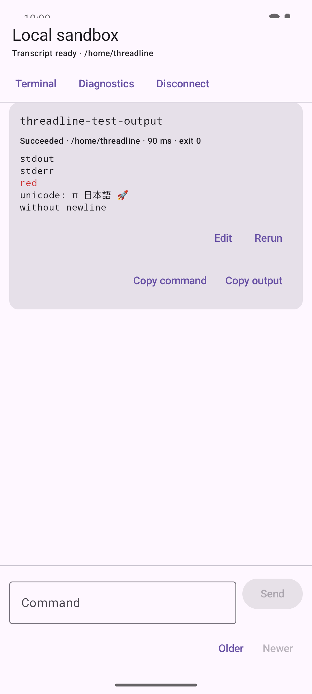
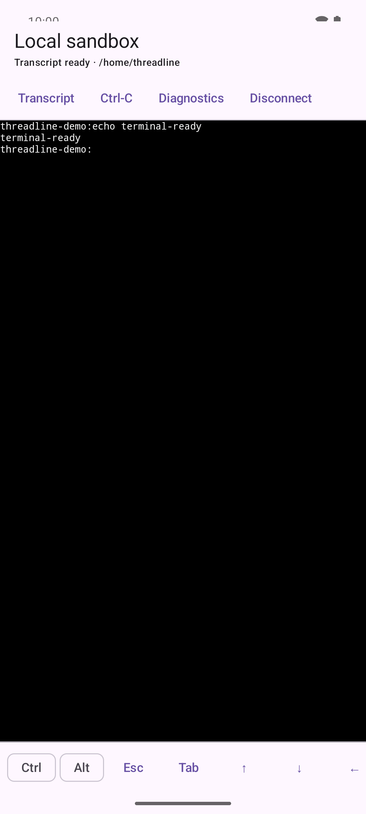

# Threadline

Threadline is an exploratory, transcript-first SSH client for Android. The
product idea is that commands should feel like messages and output should feel
like responses, while a real terminal remains underneath for interactive work.

**[Phase 5 — Alpha polish](docs/STATUS.md) is in progress.** Phase 4 security and persistence is
implemented. The app opens on a
deliberately plain command transcript with a saved multiline composer,
streaming command cards, bounded ANSI-aware output, lifecycle status,
interactive-terminal suggestions, and one-tap access to the same persistent raw
terminal with mobile modifier and navigation keys.

## Prototype tour

These captures show the current functional prototype using the repository's
local OpenSSH fixture and synthetic test output. They document behavior, not a
finished visual design.

| Transcript-first command view | Same-session raw terminal |
| --- | --- |
| [](docs/images/prototype-transcript.png) | [](docs/images/prototype-terminal.png) |

See the [complete prototype screenshot tour](docs/screenshots.md) for onboarding,
connection setup, and saved transcript history.

## What the prototype contains

- Native Kotlin, Jetpack Compose, and Material 3 app in one Gradle module
- ConnectBot's coroutine SSH library behind a narrow adapter
- A bundled Conscrypt provider with an Android Ed25519 capability probe and
  modern ECDSA/RSA-SHA2 compatibility fallback
- ConnectBot's libvterm-backed Compose terminal component
- Password and imported OpenSSH private-key authentication, with an explicit
  option to save keys under Android Keystore-backed AES-GCM encryption and to
  rename or confirmation-delete saved records
- Explicit Room-backed save, select, update, copy, and confirmation-delete for
  non-credential host profiles
- Explicit confirmation and Room persistence for unknown host keys
- Default blocking for changed host keys
- Trusted-server listing with fingerprints and timestamps, confirmation-gated
  forgetting, and no one-tap changed-key replacement
- Bounded Room-backed transcript history with a default 20-session retention
  window, newest-50-turn session snapshots, chunked 65,536-character output tails,
  confirmation-gated per-session deletion, and clear-all
- An explicit ephemeral-session option that never hands commands or output to
  the transcript archive
- A selectable, bounded diagnostic preview that redacts host fields,
  usernames, directories, commands, output, credentials, and host-key material
  by default, with explicit opt-in only for host fields, directories, and recent
  command text before Android sharing
- Typed DNS, timeout, refusal, unreachable-network, authentication, key,
  host-trust, PTY, shell, service, and session failures with non-secret recovery
  guidance and direct server/credential/settings actions
- Assertive error announcements, navigable headings, full spoken terminal-key
  labels, and a connected-session action row proven reachable at 200% system
  font scale
- A versioned, one-screen first-run introduction covering transcript and
  same-session terminal behavior, direct verified connections, credential and
  transcript-retention boundaries, plus a Help reopen path and blank production
  connection defaults
- A repeatable Android/OpenSSH performance runner for styled Unicode volume,
  long lines, progress rewrites, interruption under sustained output, bounded
  memory, and post-load recovery
- Idempotent migration from the dependency spike's private known-host
  preferences without allowing stale trust to replace a Room record
- PTY creation, raw ordered output, keyboard input, and resize propagation
- A foreground service and visible disconnect notification
- Docker-based OpenSSH fixture with password and generated Ed25519-key auth
- Unit tests for session transitions, host-key decisions, credential wiping,
  safe shell quoting, bootstrap generation, and the incremental marker parser
- Android tests for the exact Ed25519 decode/sign/verify path, selective
  connection-form retention, Room migration, and Android Keystore tamper
  detection
- A bounded, ordered input queue so rapid IME and paste events cannot reorder
  bytes on the SSH channel
- A bounded incremental transcript collector for UTF-8, line controls,
  repeated-carriage-return progress, and ANSI SGR style runs
- Immutable, session-local command turns with batched streaming updates,
  live duration, status, exit code, directory, truncation, and approximation
  state
- A multiline command composer and neutral command cards with one-shot stop,
  delayed explicit disconnect, Older/Newer command history with draft
  restoration, copy, edit, rerun, output collapsing, selectable output,
  confirmed HTTP(S) links, and raw-terminal switching
- Advisory detection of alternate-screen, cursor-addressing, mouse-tracking,
  and bracketed-paste control sequences with an explicit same-session terminal
  handoff
- A horizontally scrollable terminal key row with one-shot Ctrl and Alt plus
  Esc, Tab, arrows, Home, End, Page Up, Page Down, and Delete
- An opt-in plain-JVM smoke test that compiles the production SSH and structured
  shell code, then proves auth, PTY resize, persistent state, multiline input,
  lifecycle markers, current directory, and exit status against the fixture

## Requirements

- JDK 17
- Android SDK Platform 37
- Docker with the Compose plugin
- OpenSSH `ssh-keygen` on the development host

## Build

```bash
./gradlew test
./gradlew lint
./gradlew assembleDebug
```

With an emulator or device running:

```bash
./gradlew connectedDebugAndroidTest
```

The debug APK is written to
`app/build/outputs/apk/debug/app-debug.apk`.

Windows/WSL setup and APK-install notes are in
[the Android development guide](docs/development/windows-wsl-android.md).

## Run the SSH fixture

```bash
cd fixtures/openssh
cp .env.example .env
# Set a local-only password in .env.
./start.sh
```

The documented test username is `threadline`. The password is whatever you put
in the ignored `.env` file. The startup script also creates an unencrypted
fixture-only Ed25519 key at
`fixtures/openssh/.state/client_ed25519`.

See [the fixture guide](fixtures/openssh/README.md) for host fingerprint,
key-auth, adapter-smoke, output, shutdown, and changed-key test commands.

## Connect from an Android emulator

Use:

- Display name: `Local fixture`
- Host: `10.0.2.2`
- Port: `2222` (or `THREADLINE_TEST_PORT` from `.env`)
- Username: `threadline`
- Password: the local value from `.env`

The first connection pauses at the server fingerprint. Compare it with:

```bash
cd fixtures/openssh
docker compose exec openssh \
  ssh-keygen -lf /var/lib/threadline-ssh/ssh_host_ed25519_key.pub
```

For key auth, copy the generated private key to the emulator, choose **Private
key** in the app, and select it through Android's file picker. Check **Save
encrypted on this device** before connecting to retain an encrypted copy. A
saved key appears by name and public fingerprint on later connections; its
passphrase, if any, must still be entered for each connection and is never
saved. Saved-key labels can be renamed without decrypting or re-encrypting the
credential. Delete shows the key fingerprint for confirmation, removes only
that encrypted local record, and does not revoke its public key on a server.

Connection details can be saved explicitly as a host profile. A profile stores
only its name, hostname, port, username, stable ID, and timestamps. Selecting
one fills those fields and clears any password, private-key passphrase, saved
key choice, or pending file import. Authentication mode and credentials are not
linked to profiles. Edit the fields and choose **Update profile**, or choose
**Use as new** to preserve the fields while creating a separate profile.

Accepted host keys appear under **Trusted servers** with their algorithm,
fingerprint, first-trusted time, and last-verified time. **Forget** removes only
that trust decision after confirmation. A changed key is still blocked without
prompting: deliberate replacement requires forgetting the exact old record,
reconnecting, verifying the newly presented fingerprint through a trusted
channel, and explicitly accepting it as unknown.

Completed transcript sessions are retained locally by default. **Saved
transcripts** opens selectable plain-text history, including command status,
exit code, and truncation notices. Threadline retains at most 20 sessions, the
newest 50 turns in each saved session, the first 16,384 characters of each
command, and the last 65,536 characters of plain output per turn. Saved output
does not retain ANSI styling and does not create active links. Per-session delete and clear-all are both
confirmation-gated; they are logical SQLite deletion, not guaranteed forensic
erasure.

Transcript commands and output may themselves contain sensitive values. The
history database is local and excluded from backup and device transfer, but it
is not encrypted. Select **Ephemeral session** before connecting when commands
and output should not be archived after disconnect. A finalized saved session
survives database reopen; an abrupt process kill can still lose the current
unfinished session because archive writes happen at session finalization.

## Architecture

```text
Compose host/terminal UI
        │ events + immutable StateFlow
        ▼
SessionManager ─────────────── Foreground SshSessionService
        │
        ├── StrictHostKeyGate ── Room known-host store
        ├── Imported-key store ─ Room ciphertext + Android Keystore AES key
        ├── Host-profile store ─ Room connection metadata
        ├── Transcript store ─── Room sessions, turns, and output chunks
        ├── SshClientAdapter ─── ConnectBot sshlib
        └── TerminalBridge ───── ConnectBot termlib/libvterm
```

`TerminalBridge` is process-owned rather than composable-owned. It receives the
PTY byte stream even while the Activity is absent. The foreground service owns
the live-session policy, and its destruction cancels or closes session jobs.
Passwords and private-key passphrases are not persisted. A private key is
memory-only unless the user explicitly saves it; saved keys are persisted only
as authenticated ciphertext plus non-secret format and public-fingerprint
metadata.

The dependency choice and its open questions are recorded in
[ADR 0001](docs/adr/0001-ssh-and-terminal-libraries.md).
The Android connection failure, isolation method, root cause, fix, and remaining
risks are recorded in
[the July 2026 investigation](docs/investigations/2026-07-27-android-ssh-connection.md).

## Project status

Phases 0 through 4 are complete. **Phase 5 — Alpha polish is in progress.** Its
accessibility/error, large-output performance, Samsung physical-validation, and
basic-onboarding slices are implemented. Physical Pixel validation, a signed internal APK,
and sufficient technical-alpha use remain.

Use these records according to their purpose:

- [Current status](docs/STATUS.md) — the canonical active phase and remaining boundaries
- [Milestone history](docs/HISTORY.md) — a compact chronology
- [Investigation index](docs/investigations/README.md) — dated technical decisions and acceptance
  evidence
- [Prototype screenshots](docs/screenshots.md) — the current functional walkthrough
- [Backlog](docs/BACKLOG.md) — deliberately deferred decisions that are not current blockers

## License

Apache License 2.0. See [LICENSE](LICENSE).
