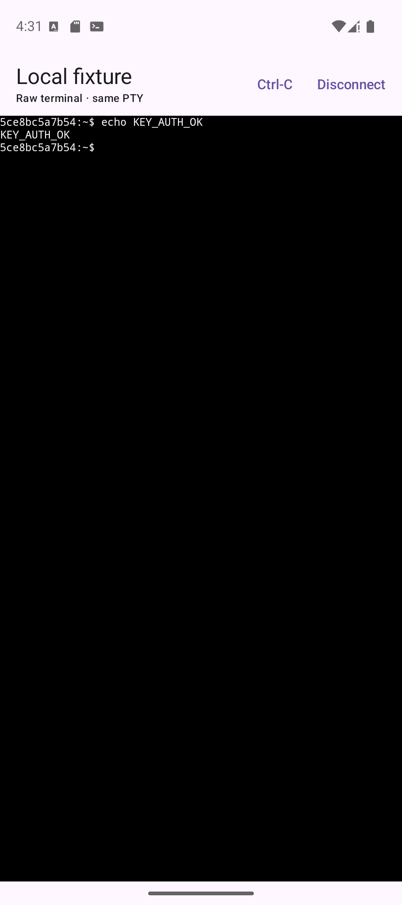
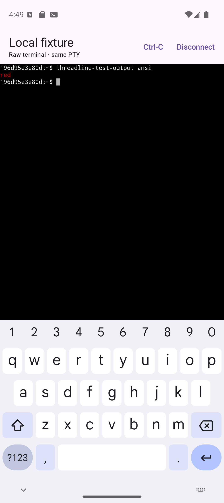
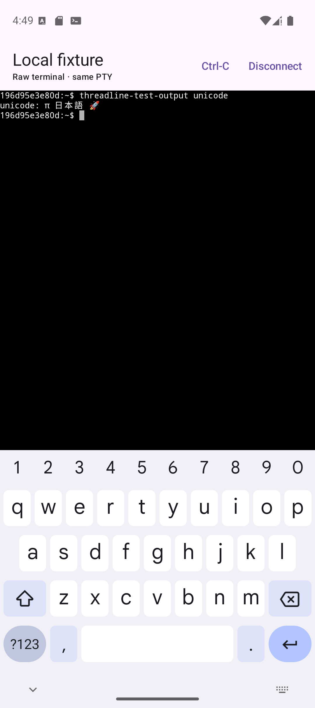
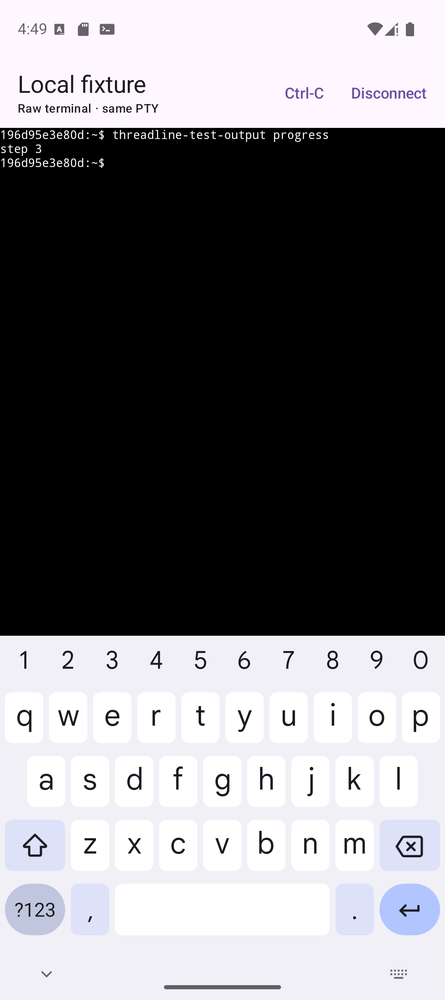

# ADR 0001: SSH and terminal libraries

- Status: Provisional — Android transport proven, device matrix incomplete
- Date: 2026-07-24

## Context

Threadline needs one persistent SSH shell channel with a PTY. Every received
byte must continuously feed a real terminal emulator, even when the terminal UI
is not visible. The same channel must support keyboard input and PTY resize.
Host verification must never fall back to an accept-all policy.

The original specification says “ConnectBot sshlib,” but that name is now
ambiguous:

- `org.connectbot:sshlib` is the older, Trilead-derived line. Its project now
  describes it as deprecated.
- `org.connectbot.sshlib:sshlib` is ConnectBot's newer Kotlin/coroutine client.

The dependency spike must use released artifacts rather than unreleased main
branches.

## Decision

Use:

- `org.connectbot.sshlib:sshlib:0.4.1`
- `org.connectbot:termlib:0.1.0`
- `org.conscrypt:conscrypt-android:2.6.1`

Both versions are pinned in the Gradle version catalog.

The new sshlib is used through `SshClientAdapter`, not directly by UI or session
state code. Its released API supports an injected suspending `HostKeyVerifier`,
password auth, OpenSSH private-key auth, PTY requests, shells, raw byte
channels, and terminal resize.

An opt-in `ssh-integration` JVM module compiles the production model and adapter
source files directly. This avoids Android's deliberately unimplemented local
test stubs while preventing a second adapter implementation from drifting away
from the app.

The termlib component is held by a process-owned `TerminalBridge`. It wraps
libvterm and exposes a Compose terminal, raw input feeding, keyboard output,
and resize callbacks. Terminal callbacks only enqueue session work; they never
call back into the emulator and therefore avoid termlib's callback reentrancy
constraint.

Known hosts use a small private `SharedPreferences` store for this spike. An
unknown key suspends the SSH handshake until the user accepts or rejects its
SHA-256 fingerprint. Acceptance persists the exact algorithm and encoded key.
A different saved key is blocked without offering a one-tap replacement.

An SLF4J no-op runtime provider disables dependency logging in the POC. This
avoids library messages containing host or username context entering Logcat.

The app installs the bundled Conscrypt provider before constructing the SSH
adapter. This follows the provider strategy used by ConnectBot's open-source
Android flavor. A real Ed25519 key-generation, X.509 decode, sign, and verify
probe decides whether the provider is usable; checking only that the algorithm
name exists is insufficient on Android.

If that probe fails, Threadline removes Ed25519 and Ed448 from its client
host-key offer for that process and retains ECDSA plus RSA-SHA2. It does not
enable legacy `ssh-rsa` signatures. Strict unknown/changed-host behavior is
unchanged in either path.

Raw input is serialized through one bounded, session-bound queue. Launching one
I/O coroutine per keyboard event reordered rapid input in the emulator even
though ordinary typing appeared healthy.

## License

- The new ConnectBot sshlib is Apache-2.0.
- ConnectBot termlib is Apache-2.0.
- termlib embeds libvterm, which is MIT licensed.

Before distribution, generate and review a complete dependency license report;
the two libraries have additional transitive dependencies.

## Consequences and limitations

- sshlib `0.4.1` targets JVM 17 and uses Ktor networking. Android build and
  runtime compatibility must be proven on the target emulator/device matrix.
- Conscrypt adds native code and APK size. Its provider is process-global, so a
  full SSH handshake test remains required in addition to the isolated crypto
  probe.
- sshlib `0.4.1` applies a hard-coded 30-second timeout to key exchange,
  including time spent waiting for the app's host-key decision. A user who
  takes longer to verify an unknown fingerprint receives a generic connection
  failure. This needs an upstream change or a two-pass verification design.
- sshlib exposes stdout and SSH extended-data streams separately. OpenSSH
  merges stdout and stderr for a PTY, which preserves the expected ordered raw
  terminal stream in the fixture. A server that emits extended data despite a
  PTY would require an upstream ordered-packet API to make a stronger claim.
- termlib contains native code. ABI packaging, rotation, font-driven resize,
  and background/foreground behavior require device testing.
- A foreground service keeps the process eligible to run; it does not promise
  an immortal network connection under OEM process management.
- The host-key store is intentionally smaller than the later Room-backed
  persistence design.
- Private keys are imported only for the authentication window and are not
  persisted in Phase 0.

## Spike evidence

On 2026-07-24, the Docker fixture and production adapter passed:

- exact SHA-256 server-fingerprint verification;
- password and generated Ed25519-key authentication;
- PTY-backed shell creation, keyboard-byte input, and returned raw bytes;
- a terminal resize from 24×80 to 41×101, confirmed by remote `stty size`; and
- host-key persistence across a fixture restart using the same Docker volume.

The fixture also produced ANSI, Unicode, carriage-return progress, and
high-volume output. The first three modes were visually verified through
termlib on Android on 2026-07-27:

- ANSI escapes were consumed and the expected token rendered red;
- `π 日本語 🚀` rendered with the expected glyphs and cell widths; and
- carriage-return progress replaced one line from `step 1` through `step 3`
  before returning to the prompt.

The first 100,000-line Android runs appeared to expose a multi-minute termlib
backlog: the visible rows continued to show `line`, and a follow-up marker only
appeared after hiding the keyboard. A dedicated `HandlerThread` made snapshot
behavior worse because termlib only uses `Choreographer` frame coalescing on
the main looper, so that threading experiment was reverted.

On 2026-07-29, instrumentation disproved the backlog diagnosis. An isolated
termlib `0.1.0` benchmark processed the equivalent stream and settled its final
snapshot in about 9.75 seconds. In the production Android path, all 600,129
observed bytes crossed into termlib in 11 seconds across 2,952 ordered chunks;
the termlib calls accounted for 9.63 seconds. Its final snapshot contained the
marker at 13 seconds, and the Compose adapter, row composition, and Canvas draw
callback all received it.

The marker was drawn at terminal rows 57–58 while the software keyboard left
only about 31 rows visible. Threadline's edge-to-edge terminal host had not
consumed the IME inset, so the live prompt was below the keyboard rather than
backlogged. Adding Compose `imePadding()` to the terminal host made termlib
resize the PTY and Canvas to the unobscured viewport. In the clean API 35
repeat, the 100,000-line stream completed and a same-PTY marker was visibly
rendered two seconds after it was sent, 17 seconds after the stream began, with
the keyboard still open.

Threadline retains the main callback looper, ordered suspending output
delivery, disconnect cancellation, and typed renderer failure. No termlib fork
or terminal replacement is justified by the high-volume evidence. The
dependency decision remains provisional only because the remaining lifecycle
and device-matrix checks are incomplete.

On 2026-07-27, a Pixel 9 Android 15 emulator and the production adapter also
proved:

- negotiation and display of the fixture's `ssh-ed25519` host key;
- explicit acceptance and persistence of its SHA-256 fingerprint;
- password authentication, PTY creation, and the raw terminal surface; and
- ordered rapid keyboard input and returned shell output.

A follow-up on the same emulator additionally proved:

- a different real Ed25519 host key at the same endpoint is blocked without an
  acceptance prompt, before authentication;
- the generated fixture Ed25519 client key can be selected through Android's
  system file picker and used for public-key authentication;
- sshd records the Android session as accepted public-key authentication; and
- that key-authenticated session opens the same PTY and returns a shell marker.

The first Android run exposed a platform/provider mismatch that the plain-JVM
smoke test could not reproduce. The investigation and exact isolation method
are recorded in
[`docs/investigations/2026-07-27-android-ssh-connection.md`](../investigations/2026-07-27-android-ssh-connection.md).

## Alternatives considered

### Older ConnectBot/Trilead sshlib

Not selected because its own artifact line is deprecated and the newer
coroutine library already exposes the Phase 0 primitives. It remains useful as
a compatibility reference, not the default dependency.

### SSHJ

Keep SSHJ as the first fallback. Re-run only the transport portion of the spike
with SSHJ if the selected sshlib fails Android networking, authentication,
server compatibility, cancellation, or ordered-stream requirements.

### Termux terminal libraries

Not selected because adopting them would require an intentional GPL-compatible
distribution decision for the whole application.

## Exit checklist

Do not mark this ADR accepted, or Phase 0 complete, until all of these have been
observed against the Docker fixture:

- [x] Password authentication succeeds.
- [x] Generated Ed25519-key authentication succeeds on Android through the
  system file picker.
- [x] The shown fingerprint matches the fixture host key.
- [x] A restarted fixture with the same volume reconnects without prompting.
- [x] A regenerated host-key volume is blocked as changed on Android without
  offering acceptance.
- [x] Raw commands and ANSI output render in termlib.
- [x] Unicode and carriage-return progress render correctly in termlib.
- [x] A 100,000-line stream renders without crashing the process, and the same
  PTY remains usable afterward.
- [x] High-volume output drains and a same-PTY follow-up marker remains visible
  above the open software keyboard.
- [x] Keyboard input reaches the same PTY and remains ordered under a rapid
  event burst.
- [ ] Rotation changes PTY dimensions and `stty size` confirms them.
- [ ] Backgrounding shows the foreground notification; returning preserves
  terminal state.
- [ ] Disconnect closes the channel without leaked jobs or threads.
