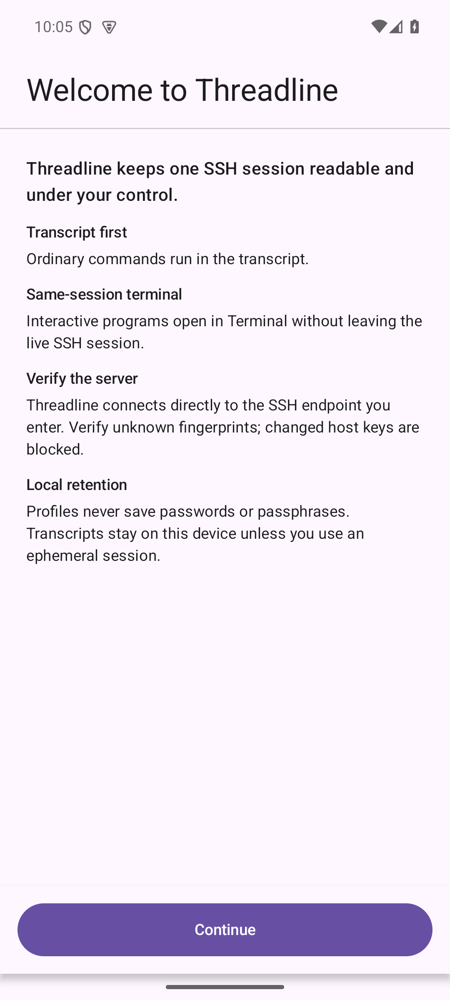
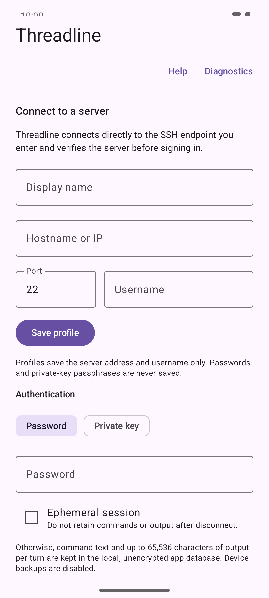
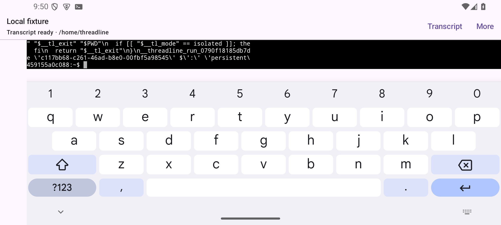
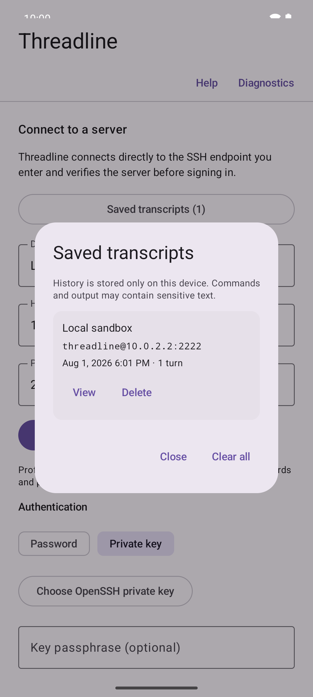

# Threadline prototype screenshots

These screenshots were captured from the Android prototype on an API 35 emulator
at the default font scale. The compact landscape capture was added on 2026-09-08,
the onboarding capture was refreshed on 2026-09-06, and the remaining captures
are from 2026-08-01. They use the repository's local OpenSSH fixture, its documented
emulator address, and synthetic test output. No production host, credential,
command, or server fingerprint is shown.

The screenshots document working behavior. Typography, spacing, color, and
responsive layout remain prototype UI rather than a final visual design.

## Getting oriented

| First-run introduction | Blank connection setup |
| --- | --- |
|  |  |

## Working in one SSH session

| Structured transcript | Raw terminal |
| --- | --- |
|  |  |

The transcript view keeps command status, working directory, duration, exit
code, output, and follow-up actions together. The terminal view remains attached
to the same PTY for interactive work and exposes mobile modifier and navigation
keys.

## Compact landscape terminal

On API 35, opening Gboard in landscape collapses the connected header while
keeping the session identity, state, Transcript, and More reachable. The
terminal-key row stays available through More and is hidden by default in this
constrained state. Gesture and three-button navigation were checked separately.

## Local transcript history

History is local, bounded, excluded from Android backup, and not encrypted.
Ephemeral sessions bypass it entirely; see the [current status](STATUS.md) and
[project specification](../PROJECT_SPEC.md) for the exact product boundaries.
